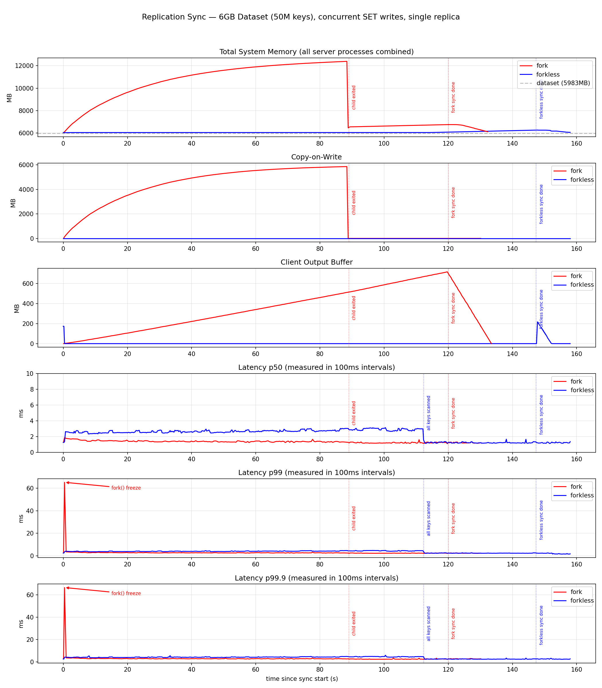
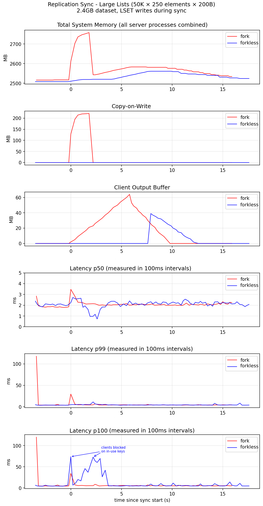

Valkey traditionally uses the operating system's `fork()` mechanism to create point-in-time snapshots for persistence (`BGSAVE`) and full synchronization (replication).
When Valkey forks, the child process shares the parent's memory pages using copy-on-write (CoW).
This approach has several operational drawbacks:

1. The `fork()` syscall blocks the main thread while the kernel duplicates the process's page table.
   The duration scales with dataset size — typically ranging from tens of milliseconds to hundreds of milliseconds on large instances.
   Valkey is unresponsive for the entire duration.
2. Under write-heavy workloads, CoW can cause memory usage to grow up to 2x, as every modified page must be duplicated by the kernel.
   In memory-constrained environments (such as Kubernetes pods or cgroups), this unpredictable memory growth can trigger the OOM-killer.

Forkless operations eliminate these problems by performing persistence and replication without calling `fork()`.
Because no fork occurs, there is no CoW, no memory spike, and no latency freeze.
The tradeoff is that clients writing to a key can be briefly blocked while that key is being captured, and forkless operations can be slightly slower end-to-end.

## When to use forkless

Forkless is most beneficial when:

* Memory is constrained and CoW overhead is unacceptable.
* Fork latency spikes are unacceptable.

When memory is plentiful and brief fork latency spikes are acceptable, fork-based operations may still be preferred.

## Consistency guarantees

Forkless provides two consistency modes depending on the operation:

* **Forkless save (persistence)**: provides a point-in-time snapshot, equivalent to a fork-based `BGSAVE`.
  All keys are captured as they existed at the moment the operation began.
* **Forkless full synchronization (replication)**: provides eventual consistency, equivalent to fork-based full synchronization.
  Keys are captured as they currently exist, and writes to already-captured keys are streamed inline.
  The replica achieves full consistency by the end of the transfer.

Read commands are never affected in either mode.

## Client blocking behavior

During forkless operations, a client may be briefly blocked when it writes to a key that is currently being captured.
The blocking duration depends on the size of the key — larger keys (such as large sorted sets or hashes) take longer to capture and block for longer.

Key characteristics of blocking:

* Only write commands can be blocked; reads are never affected.
* The probability of hitting a key while it is being captured is generally low.
* For small keys (typically <= 512 bytes), an optimization allows the client to proceed immediately without blocking.
* Applications with very large keys and high write rates to those keys should account for possible latency spikes. Consider breaking large collections into smaller keys to reduce blocking duration.

## Configuration

### Enabling forkless support

Forkless requires per-key metadata.
Enable it at startup (this is an immutable configuration):

    forkless-options-supported yes

When enabled, the server allocates 4 additional bytes per key in the database.
Enabling this setting does not change any behavior on its own — it only enables the infrastructure.

### Forkless persistence

Once `forkless-options-supported` is enabled, configure automatic forkless saves:

    CONFIG SET threadsave-enabled-for-backup yes

When set to `yes`, both auto-save rules and plain `BGSAVE` commands use forkless snapshots.

You can also trigger specific methods explicitly:

* `BGSAVE THREAD` — explicitly triggers a forkless snapshot.
* `BGSAVE FORK` — explicitly triggers a fork-based snapshot.
* `BGSAVE` — uses the method configured by `threadsave-enabled-for-backup`.

### Forkless replication

On the primary, enable both settings:

    forkless-options-supported yes
    threadsave-enabled-for-replication yes

On the replica, no special configuration is needed — the replica only needs to be running a version of Valkey that includes forkless support.
A compatible replica automatically advertises its support during the handshake.

The primary uses forkless full synchronization when all conditions are met:

1. `forkless-options-supported` is enabled on the primary.
2. `threadsave-enabled-for-replication` is enabled on the primary.
3. All connected replicas support the feature.

If any condition is not met, the primary falls back to fork-based sync automatically.
This makes the transition safe — a primary with forkless enabled can serve both new and old replicas without manual intervention.

Forkless replication supports both disk-target and socket-target modes (controlled by `repl-diskless-sync`).

## Monitoring forkless operations

Forkless operations report their status through the `INFO` command.
The `rdb_current_bgsave_type` and `rdb_last_bgsave_type` fields indicate which method is in use or was last used — `thread` for forkless, `fork` for fork-based, or `none` if no save is in progress.

During an active forkless operation, additional fields are available:

* `threadsave_current_item_seconds`: how long the current key has been serializing. A high value here indicates a large key that is blocking clients.
* `threadsave_estimated_seconds_remaining`: estimated time to completion based on keys processed so far.

For more granular debugging, the following fields are available in the `debug` section of `INFO`:

* `threadsave_current_queue_length`: number of items currently queued for processing.
* `threadsave_queue_length_target`: the target queue depth.
* `threadsave_dbentries_queued`: total entries placed in the queue so far.
* `threadsave_dbentries_processed`: total entries processed by the background thread so far.

## Comparison with fork-based operations

There is an infinite number of scenarios and variables one can tweak when comparing fork-based and forkless full synchronization: the number of replicas, the number of connected clients, write intensity, key sizes, data types, whether writes overwrite existing keys, add new keys, delete them, or a combination at various ratios — and more. The scenarios presented here were chosen to show forkless close to its extremes — at its best and at its worst — to illustrate when forkless should and should not be chosen over fork-based sync.

### Scenario 1: Many small keys under heavy writes

In this scenario, a primary holds a 6GB dataset composed of 50 million keys, with concurrent SET commands overwriting existing keys during the sync. A single replica connects for full synchronization.

**Memory:**

In the fork-based case, total system memory grows from approximately 6GB to 12GB — nearly 2x the initial dataset. This growth is composed almost entirely of copy-on-write: because the writes were hitting keys dispersed across the entire key space during the sync, virtually every page was duplicated by the kernel. In practice, writes do not need to hit the entire key space or be particularly intense — it is sufficient for writes to touch keys dispersed among many different pages. Hitting a single key on a page just once is enough for that page to be duplicated.

Additionally, in fork-based sync without dual-channel-replication, incoming replication commands are accumulated in a Client Output Buffer (COB) and only sent to the replica once the initial RDB transfer completes.

In the forkless case, all three metrics — total system memory, CoW, and COB — remain nearly flat, due to the virtually zero memory overhead of forkless operations.

It is also worth noting that in a memory-constrained environment, forkless is particularly beneficial. If the 6GB dataset represents 50% of available memory capacity, fork-based sync would push usage to 100%. If 6GB is only a small fraction of available memory (e.g. 10%), doubling to 20% may be acceptable — but the fork freeze described below should still be considered.

**Sync completion time:**

Fork-based sync completes slightly earlier than forkless in this scenario. However, when accounting for the additional time required for the fork-based approach to drain the COB (which is necessary for the replica to fully catch up), the difference shrinks. In some configurations, forkless sync matches or even slightly beats fork-based sync in total time to replica readiness.

**Latency:**

During forkless sync, client write latency is slightly higher — in this scenario, approximately 2x compared to fork-based. This is the tradeoff for the memory savings.

However, fork-based sync shows a clear latency spike at the very beginning: the fork() freeze. In this case, the freeze is approximately 65ms. Forkless sync shows no such spike. The duration of the fork freeze is empirically proportional to the initial dataset size — the larger the dataset, the longer the freeze due to the page table that must be copied.

### Scenario 2: Large collection keys

In this scenario, the dataset is 2.4GB, composed of 50,000 lists, each containing 250 elements of 200 bytes. This is engineered to showcase the blocking behavior of forkless operations on large keys.

**Memory:**

The memory story is similar to scenario 1: fork-based sync shows memory growth correlated with CoW and some COB growth, though in this case it does not reach 2x. Forkless memory consumption also grows slightly but remains far below the fork-based case.

**Latency:**

At p50 and p99, latency remains roughly the same between fork and forkless, apart from some outliers. The fork freeze is also visible in the fork-based case.

At p100, the difference is striking. Fork-based latency stays mostly flat, but forkless shows spikes reaching up to 75ms. These are clients blocked on in-use keys — their SET commands are writing to keys currently being serialized. Serializing large lists takes time, and the client is blocked for the duration.

However, a notable observation: these spikes are clearly visible in the p100 graph but do not appear at all in p99. This tells us that even in this scenario — engineered specifically to showcase blocking — it is still quite rare for a client to be blocked. The probability of hitting a key at the exact moment it is being serialized is low. In more extreme cases (for example, a single massive key that represents the entire dataset), blocking probability would approach 100%. But in typical workloads, blocking is infrequent — as demonstrated here, where fewer than 1% of writes experienced it.
